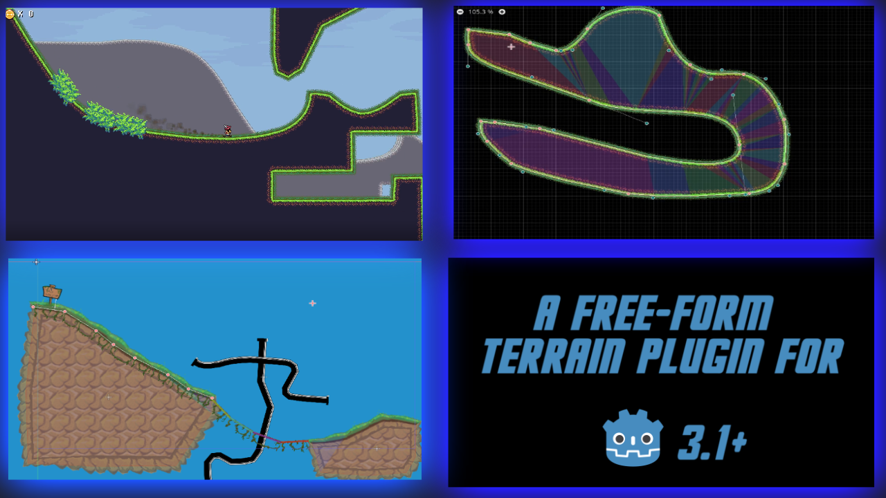

 RMSmartShape2D
---

# About
This plugin, currently aimed at the Godot Game Engine 3.1+, provides the ability create non-uniform shaped objects using assets very similar to what you would use if producing your levels with tilesets.

# Shape Materials
Shape materials, known as RMSmartShapeMaterial, provides all the texture and collision information needed by the RMSmartShape2D node.  The shape material focuses on rendering of the non-uniform shape as if it was a nine-patch image (including sharp 90-degree corners!).  Once a shape material is defined, it can be easily reused by any number of RMSmartShape2D nodes.

# Rendering the Shape Material
In order to show your fancy shape material you must first create a RMSmartShape2D node.  Then do the following two things:
1. Assign the material to the Shape Material property of the node.
2. Plot your points within the editor to represent your shape.

# Anchoring Nodes to Sections of the Shape Node
You might have a desire to anchor nodes to various sections of the RMSmartShape2D node.  This is helpful in the level design by helping to automatically move other nodes in relation to the edited shape node.  Or, in the future, it might be useful adjust a shape dynamically and have the surrounding objects be affected by adjustments in the shape's contour.

This is done by use of the RMSmartShapeAnchor2D node.

# Keyboard Controls
- Cycle through texture indices of a vertex
  - Mouseover a vertex and MOUSEWHEEL up or down to increment / decrement the texture index

- Flip texture
  - Mouseover a vertex and press SPACE

- Move Edge
  - While in MOVE mode, mouseover an edge, hold SHIFT, then click and drag to move the two points that makeup the edge

- Add Bezier curve
  - Mouseover a vertex, hold SHIFT, then click and drag to create control points on the vertex

- Change texture width property
  - Mouseover a vertex, hold SHIFT, then MOUSEWHEEL up or down to increment / decrement the texture width

# Contibuting
If you have any suggestions, feel free to add an issue.
Please include the following three bits of information in each issue posted:
- Bug / Enhancement / Suggestion
- Godot Version
- RMSMartshape Version

# Version History
## Changes in 1.3
This update primarily fixes bugs and improves existing features to be more usable.
### Changes
- Merged top/left/right/bottom offset into one variable. render offset
### Fixes
- Input bugs
- Edge Flipping
- Polygon orientation bugs
- Quad Welding
- Corer quad generation and welding
- Collision variables in the RMSmartShapeMaterial working as intended

## Changes in 1.2
### Tweaks
- Refactoring
- Toolbar takes less space
- Minor bug fixes

### New Features
- Bezier Curves!
  - Hold shift on a control point to create a curve
- Corner Quads!
  - Both inner and outer corner quads are now generated
  - Textures can be speciied for each direction of both inner and outer quads
- Edge Moving!
  - Can move an edge (two points) by pressing SHIFT in move mode and dragging the edge

## Changes in 1.1
- Refactoring
- Fixed Errors Occuring when Texture Arrays are size '0' but not null
- Fixed sync between texture, flip, and width indicies
    - Would sometimes share a single array between the 3 vars
    - Are all unique now

- Snapping
- More informative toolbar

## Changes in 1.0
- Fixed many debug errors reported related to indexing beyond array sizes
- Fixed control point wrapping of RMSmartShapeAnchor2D nodes anchored to RMSmartShape2D nodes.
- Tested on newly released 3.2 Godot.

## Changes in 0.91
- Edges are calculated in relationship to object space instead of screen space
- Added option to allow user to let the object recalculate edges based on screen space.
- Fixed uv calculations for flipped textures.
- Fixed uv bug for edge sections less than half the size of texture width
- Added option to allow for a RMSmartShapeAnchor to mimic scale of monitored node
- Removed sections of code related to clockwise versus clockwise checks, very specifically regarding the direction of texture edges.
- Corrected normal texture bug for fill and edge rendering
